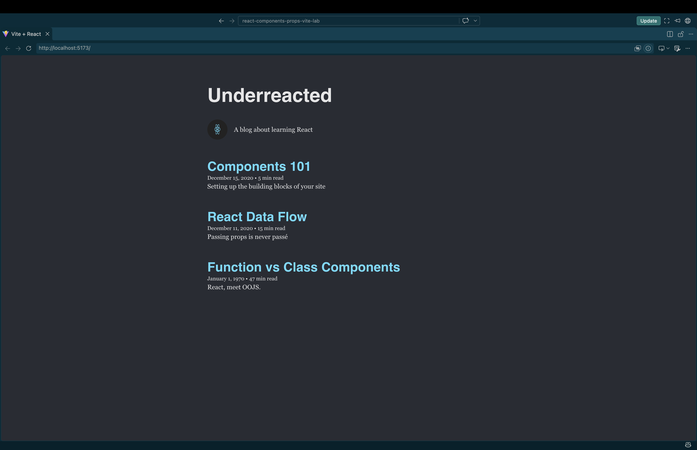

# React Components and Props Blog

A simple blog application built with React and Vite to practice creating reusable components and passing data between components using props.

## Features

- Displays a blog header with the blog name
- Displays an about section with an image and description
- Renders a list of blog posts dynamically
- Uses props to pass data from parent components to child components
- Uses default prop values when certain data is unavailable

## Component Structure

App
├── Header
├── About
└── ArticleList
    └── Article

## Props and Data Flow

The blog data is passed from `App` down to the components that need it.

- `Header` receives the blog `name`
- `About` receives the `image` and `about` text
- `ArticleList` receives the `posts` array
- `ArticleList` maps over the posts and passes `title`, `date`, and `preview` to each `Article`

This project demonstrates React's one-way data flow, where data is passed from parent components to child components through props.

## Technologies Used

- React
- JavaScript
- JSX
- Vite
- Vitest
- React Testing Library

## Author
a-gbatie

## Screenshot


## Getting Started
Install the project dependencies:

```bash
npm install

